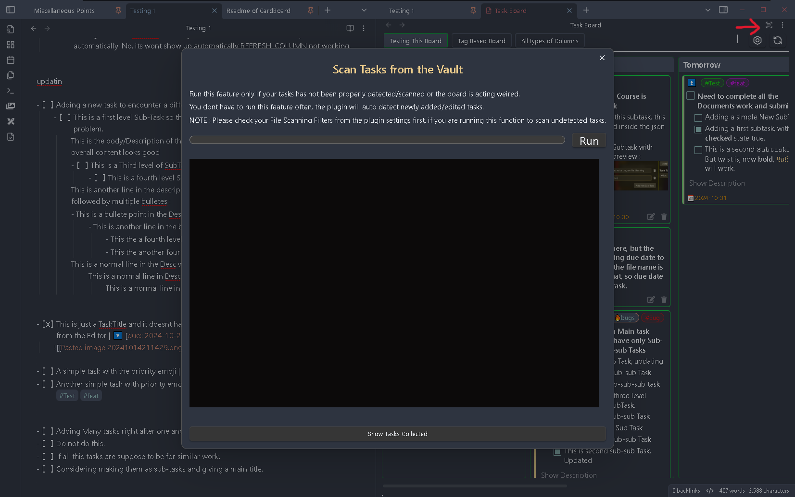

# Re-Scan Vault Feature

This feature helps you to scan your whole Vault files to extract the tasks. After installing the plugin you will be required to run this feature to extract all tasks only for the first time.

You dont have to run this feature after the initial setup, since all your tasks will be [auto-scanned](../Features/Auto_Scanning_Files.md) from the files you have modified.

But you can make use of this feature, if you have found some issue while extracting the tasks or few of your tasks has not been extracted properly.

You can also use an option from the setting to run this feature at Obsidian startup. This settings option is been kept OFF by default, since in normal case, you wont be required to run the Re-Scan feature often. But if in your specific situation, if you are modifying your markdown files outside of Obsidian or when Obsidian is closed, you can turn on this setting option.

Please note  that, if your Vault is very large in size and contains files with huge amount of data, then consider applying [Scan Filter](../Features/Filters_for_Scanning.md) to only scan specific files or restrict from scanning certain files, to save the scanning time.

## Re-Scan Window

In this wiindow you can see a terminal like section. Once this window is open to scan all the files you need to click on the Run button. After you click on the run button the plugin will start scanning all the files from your vault to detect any tasks are present in them.

During scanning, you can see which file is getting scanned at present or which all files got scanned in the terminal like section. The progress bar will also show the progress of the current operation and you should able to see the precentage value in the button text.

After the scanning operation is complete, you can see all the tasks which has been collected in the All Tasks Preview section which is hidden and can be opened using the `Show
Tasks Scanned` button at the bottom. Once you click on this button, a new section will slide in from the right taking the space of the terminal section. In this preview section you will be able to see which all tasks has been extracted from the corresponding scanned files, mentioned as the heading.
