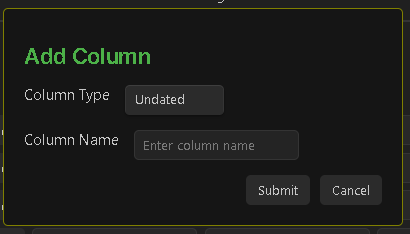

# How to use the Board Specific Settigns

You can able to open the Board Specific Settings from the Configure Board buttton onthe top right corner in the Task Board View as can be seen in the below impage.

< Image showing the Configure Button Icon >

< Image Showing the Board Config Modal >

**NOTE :** Remeber to press on the `Save` button after you have changed any value for the Board settings.

## Basic Settings

### Board Name

In this text input field you will be able to enter the Name of the Board or change it any time

### Show tags for namedTag type columns

> This settings only works for namedTag type of columns.

Since, the column of type namedTag will show all the tasks which has the specific tag. Then it makes no sense to show the tag on the tasks, since its obvious that all the tasks under the specific column will have the same tag as that of the Column tag.
Hence you can decide to hide this tag from all the Task Items under this column.

For multi-tag Task Item, other tags will be show, only the specific tag will be hidden.

## Board Filters

These are the filters you can apply to this specific board. The [Filters for Scanning](docs/Features/Filters_for_Scanning.md) works while scanning the tasks from your vault. But after all your tasks has been scanned, you can decide which of this tasks you want to see on the current board using this **Board Filters** using the following settings.

### Filter Tags

Iin this text input field, you can enter the tag names along with the '#' symbol prepended. Separate all the values with a comma.

For example, you can enter : #Test, #Bug, #New

Now, from all the scanned tasks, only the tasks which contains either one of this tags will be shown under this board. Rest of the tasks will be hidden.

### Filter Polarity

This is a toggle input, where you can enable or disable the complete **Board Filters** feature. 
If this checkbox is enabled, then this filters will be applied on this board.
If this checkbox is disabled, then the filters will not be applied.

You can use ths feature, kind of like searching or viewing only the specific tasks for a moment and then disable it, to see all the applicable tasks under this board.

### Show Filtered Tags

This is again a checkbox field, which gives you an option to either show the tags on the Task Items or keep them hidden. Since, if you have enabled this feature to only show tasks which has, for example, `#Test` tag. Then You can disable this option, so the `#Test` tag will be hidden from the Task Items.

## Columns

Under this section of settings you will see a tabular format arrangement to configure the columns under this board and also change their position.

The first row in this tabular data show the information of the Task Board column and it will be show at the first postion in the Task Board View. Followed by the rest of the Columns in order.

### Properties of the Column

**Handler Button :** This button helps you to drag and drop the row, to arrange the postion of the Column inside the Task Board. If you want to change the position of the column, say from the first position to the third. Then you will have to drag the row inside this Tabular data to the third position. After saving your column will be moved to the third postion from the first.

**Eye Icon :** Use this button to hide your column from your board. If say, you dont want to see a specific column in the current board, but also do not want to delete that column. You can keep the board hidden, as long as you want.

**Column Type :** At present there are total 6 types of columns. Learn more about each of theme from here : [Types of Columns](docs/Features/Types_Of_Columns.md).
- **From :** Enter the value, either positive, zero or negative. Zero mean, all tasks which are scheduled for today. Postive value means, due date starting from today and in future. Negative value means, startuing from today and days in past. 
- **To :** Enter the end value, till which the due date will be considered. Use the Types of Columns section to understand this properly.

**Column Name :** This text input field will allow you to enter or change the name of the column.

**Max number of Items :** Currently this feature is only available to a column of type `Completed`, to restrict from showing all your completed tasks. Its recommended not to show all your completed tasks on the board, if you have completed many tasks. Only show few tasks under this column, by entering the number here, how many tasks you want to see under this column, which will help you to render the board faster.

- In the future releases, there will be a new window to see all your Completed tasks.

**Delete Icon :** Using these Icons, you can able to delete the specific Column from the board. This will only delete the column and wont affect any of your tasks. You can easily create the column back if you know the configuration of this column.

### Add Column Button

This button allows you to add more column to this board. Once you press on this button, a pop will appear as shown below :

This pop-up will ask you to select the type of the new board and the name of this new column, which are the most important fields. Dont worry, you can change the name of the column later at any time. But the type of the Column will be fixed. If you want to change the type, you will have to create a new Column and delet the previous one.

## Delete This Board Button

This button will delete the current board. After you click on this button, a pop up will appear to ask you for Confirmation.

This operation is not reversible. Take care while delete the board. But its also easy to create a new board, if you remeber the board structure. Dont worry.

> Delete a board or changing any setting inside the board makes no changes to you tasks. You can only change the content of your tasks either from the Edit Task window or using the delete button inside the Task Item Card.
